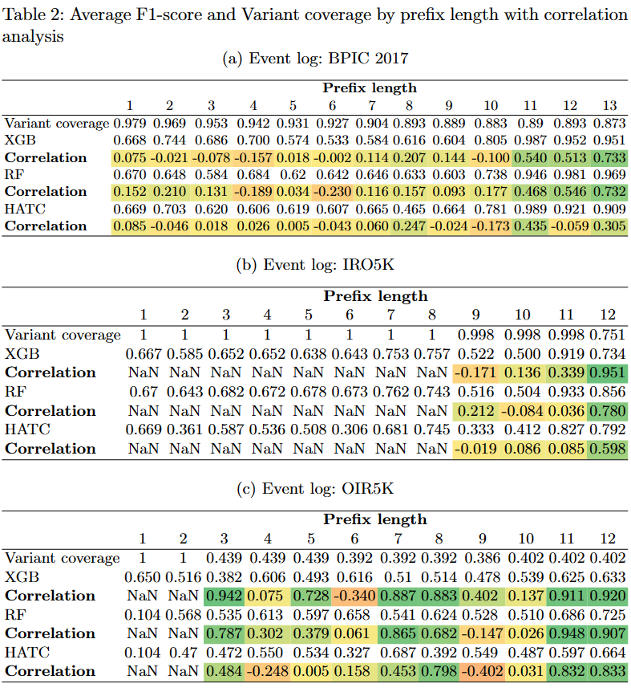
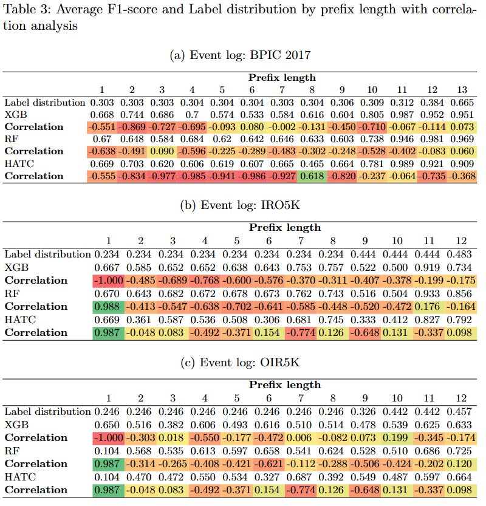
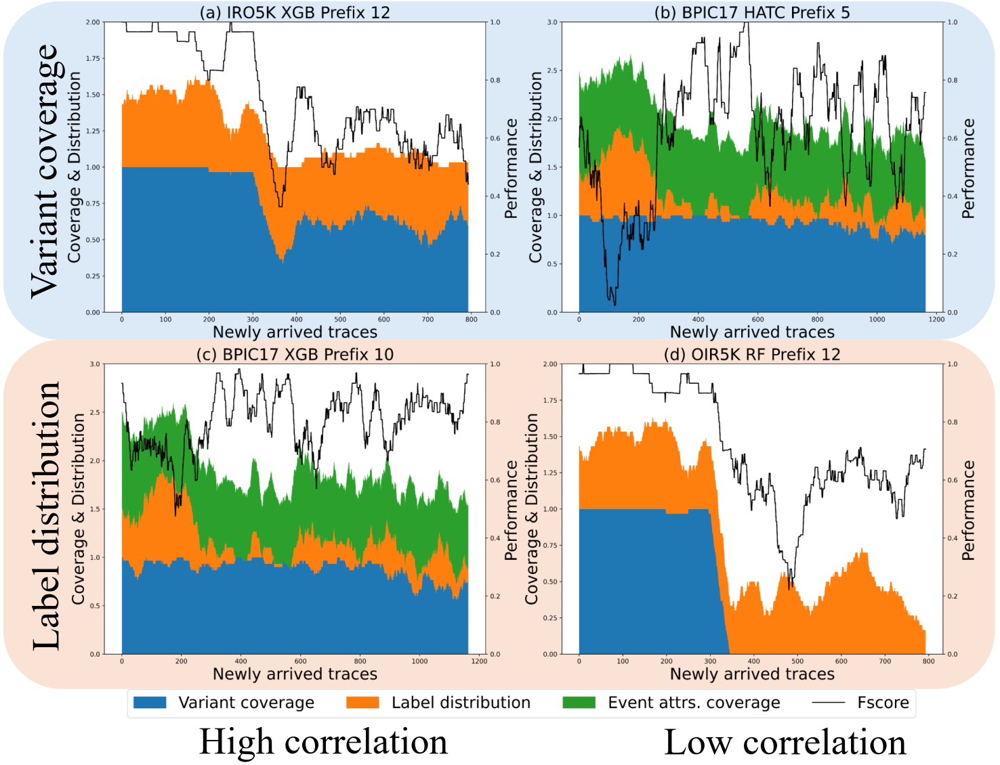

# Exploring the Performance Dynamics of Online Predictive Process Monitoring using Log Features
## Suhwan Lee 1, Xixi Lu1, Hajo A. Reijers1

1 Utrecht University, Utrecht, The Netherlands

## Abstract
Predictive process monitoring is essential for forecasting on-going process outcomes. However, in practical online settings fluctuations of prediction performance are problematic. While existing research addresses performance drifts or stability measures, understanding the underlying causes of these fluctuations remains limited. This study aims to fill this knowledge gap by investigating factors contributing to performance variability in prediction models for online process outcome predictions. Through an analysis of log features and their correlation with model performance over time, insights are provided to inform strategies for mitigating performance drops and enhancing model reliability. Our results show a high correlation between log features and the model performance in many cases. Retraining the prediction models based on these insights shows accordingly shows improvement in both average performance and stability. Understanding these factors enables the development of resilient models and tailored retraining strategies, avoiding unnecessary retraining, energy consumption, and costs.

## Log features
__1. Variant coverage__
This feature measures the appearance of newly observed variants in the test data, which were not included during model training. 

$$
V_{ti} = \frac{\lvert Var(W_{train}) \cap Var(W_{ti}) \lvert}{\lvert Var(W_{ti}) \lvert}
$$

__2. Label distribution__
This log feature measures the appearance of newly observed categorical event-level attributes in the test data.

$$
D_{ti} = \frac{\lvert \{\sigma \lvert \sigma\in W_{ti} \wedge y(\sigma) = TRUE \} \lvert}{\lvert \{ \sigma \in W_{ti} \} \lvert}
$$

__3. Event level attributes coverage__
This log feature measures the appearance of newly observed categorical event-level attributes in the test data.

$$  
C_{ti} = \frac{\lvert \{ D_{test} \} \cap \{ D_{train} \}\lvert}{\lvert \{ D_{test} \}\lvert}
$$

## Results
__Overview__

    
    
    
    Figure: Four configurations selected based on the log feature correlation

__Retraining strategy__
[Figures](./train_once_vs_retraining.md "Comparing performance from train once vs retraining")