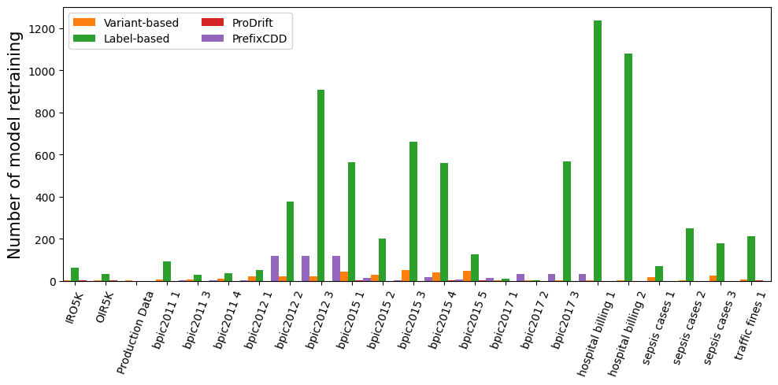

__Overview__

    Comparison of Accuracy Scores for Random Forest Across Event Logs by Trigger Method
    

__Model Update Frequency__

    Frequency of Model Updates Across Event Logs by Triggering Methods
    

__Average Retraining Time Comparison__

    Comparison of Average Training Time Across Classifiers
    

